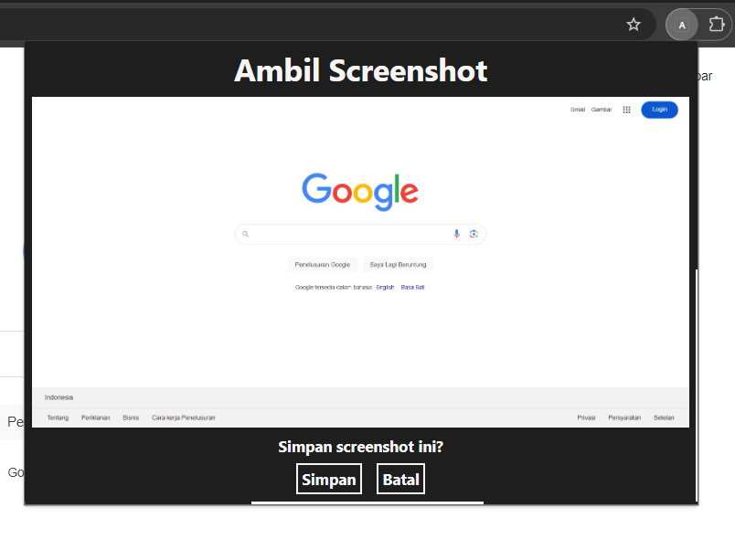
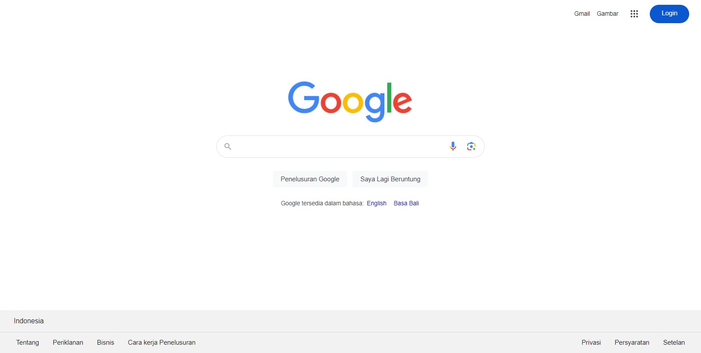

# Ambil Screenshot
Ekstensi Chrome untuk mengambil screenshot dari tab yang sedang digunakan.

## Deskripsi
**Ambil Screenshot** adalah ekstensi Chrome yang memungkinkan pengguna untuk dengan mudah mengambil gambar layar (screenshot) dari tab yang sedang dibuka. Setelah ekstensi diaktifkan, pengguna hanya perlu mengklik ikon ekstensi untuk melihat pratinjau screenshot, serta memiliki opsi untuk menyimpan atau membatalkannya. Ekstensi ini hanya dapat digunakan di **desktop**.

## Fitur
- Ambil screenshot tab aktif dengan satu klik.
- Tampilkan pratinjau hasil screenshot.
- Simpan gambar atau batalkan aksi melalui popup.

## Instalasi
Ikuti langkah-langkah berikut untuk menginstal ekstensi ini secara lokal di browser Chrome:

1. **Unduh** atau clone repositori ini. Jika mengunduh dalam format zip, ekstrak file zip tersebut.
2. Buka Chrome, klik ikon menu (tiga titik) di pojok kanan atas layar.
3. Pilih **Ekstensi** dari menu, kemudian klik **Kelola Ekstensi**.
4. Aktifkan **Mode Pengembang** dengan mengaktifkan tombol di pojok kanan atas halaman Ekstensi.
5. Klik tombol **Muat yang belum dibuka** dan pilih folder tempat kamu mengekstrak atau meng-clone repositori ini.
6. Ekstensi **Ambil Screenshot** sekarang akan muncul di daftar ekstensi. Aktifkan ekstensi dengan menggeser tombol toggle.

## Cara Penggunaan
1. Buka tab yang ingin kamu ambil screenshot-nya.
2. Klik ikon ekstensi **Ambil Screenshot** di toolbar Chrome.
3. Sebuah popup akan muncul menampilkan pratinjau screenshot.
4. Klik **Simpan** untuk menyimpan gambar ke perangkatmu, atau klik **Batal** untuk menutup popup tanpa menyimpan.

## Contoh Penggunaan

### Tampilan Popup
Setelah mengambil screenshot, popup berikut akan muncul dengan pratinjau gambar dan opsi untuk menyimpan atau membatalkan.

### Contoh Hasil Screenshot
Berikut adalah contoh screenshot yang dihasilkan dari ekstensi ini:

## Lisensi
Ekstensi ini menggunakan lisensi [MIT](./LICENSE).